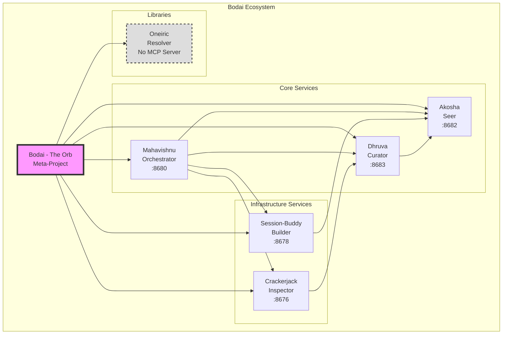

# Bodai Architecture

This document describes the system architecture of the Bodai ecosystem, including component boundaries and data flow patterns.

## System Overview



## Component Boundaries

Each component in the Bodai ecosystem has well-defined ownership and responsibilities:

| Component | Role | Owns | Does Not Own |
|-----------|------|------|--------------|
| **Bodai** | Meta-Project | Configuration registry, documentation hub, operational tools | Direct service implementation, runtime orchestration |
| **Mahavishnu** | Orchestrator | Workflow definitions, engine selection, task routing | Data persistence, session state, quality enforcement |
| **Akosha** | Seer | Vector embeddings, cross-system intelligence, pattern recognition | Workflow execution, object storage, CI/CD pipelines |
| **Dhruva** | Curator | Persistent object storage, ACID transactions, data versioning | Session management, workflow orchestration, quality gates |
| **Session-Buddy** | Builder | Session lifecycle, knowledge graphs, conversation history | Workflow execution, quality enforcement, long-term storage |
| **Crackerjack** | Inspector | Quality gates, testing frameworks, CI/CD pipelines | Session management, workflow routing, vector search |
| **Oneiric** | Resolver | Conflict resolution algorithms, dependency analysis | MCP server, network endpoints, state management |

## Data Flow

The Bodai ecosystem follows clear data flow patterns between components:

### Session-Buddy to Akosha

```
Session-Buddy (8678)
    |
    | Session data, conversation history
    v
Akosha (8682)
    |
    | Vector embeddings, intelligent retrieval
    v
Cross-system knowledge
```

Session-Buddy captures session lifecycle data and conversation context, which flows to Akosha for vector embedding generation and cross-system intelligence. This enables:

- Semantic search across all sessions
- Pattern recognition in user behavior
- Intelligent context retrieval for future sessions

### Mahavishnu to All Components

```
                    +---> Akosha (8682)
                    |     [Intelligence queries]
                    |
Mahavishnu (8680) --+---> Dhruva (8683)
[Orchestrator]      |     [State persistence]
                    |
                    +---> Session-Buddy (8678)
                    |     [Session context]
                    |
                    +---> Crackerjack (8676)
                          [Quality validation]
```

Mahavishnu serves as the central orchestrator, routing tasks to appropriate components based on:

1. **Akosha**: For intelligence operations requiring vector search or pattern analysis
1. **Dhruva**: For persistent storage of workflow state and results
1. **Session-Buddy**: For session context and conversation tracking
1. **Crackerjack**: For quality validation of workflow outputs

### Crackerjack to All Components

```
                    +---> Mahavishnu (8680)
                    |     [Workflow quality checks]
                    |
Crackerjack (8676) --+---> Akosha (8682)
[Inspector]          |     [Code analysis embeddings]
                    |
                    +---> Dhruva (8683)
                    |     [Quality reports storage]
                    |
                    +---> Session-Buddy (8678)
                          [Session quality metrics]
```

Crackerjack enforces quality across the ecosystem by:

1. Validating workflow definitions before Mahavishnu executes them
1. Generating code analysis embeddings in Akosha for pattern detection
1. Storing quality reports and metrics in Dhruva for historical tracking
1. Recording quality metrics per session in Session-Buddy

### Dhruva to All Components

```
                    +---> Mahavishnu (8680)
                    |     [Workflow state recovery]
                    |
Dhruva (8683) -------+---> Akosha (8682)
[Curator]            |     [Historical data for patterns]
                    |
                    +---> Session-Buddy (8678)
                    |     [Session backup/recovery]
                    |
                    +---> Crackerjack (8676)
                          [Quality trend data]
```

Dhruva provides persistent storage services to all components:

1. **Mahavishnu**: Workflow state recovery for resumable operations
1. **Akosha**: Historical data for pattern recognition and trend analysis
1. **Session-Buddy**: Session backup and disaster recovery
1. **Crackerjack**: Quality trend data for longitudinal analysis

## Architecture Principles

### Separation of Concerns

Each component has a distinct responsibility:

- **Orchestration** (Mahavishnu) vs **Intelligence** (Akosha) vs **Storage** (Dhruva)
- **Session Management** (Session-Buddy) vs **Quality Enforcement** (Crackerjack)
- **Libraries** (Oneiric) provide shared utilities without network overhead

### Single Source of Truth

- **Dhruva** is the single source of truth for persistent data
- **Session-Buddy** is the single source of truth for session state
- **Bodai** is the single source of truth for configuration

### Fail-Safe Design

- Components can operate independently if others are unavailable
- Dhruva provides ACID guarantees for critical data
- Crackerjack enforces quality gates before changes propagate

## Related Documentation

- [Component Roles](roles.md) - Detailed descriptions of each component
- [Symbiosis](symbiosis.md) - How components work together
- [Port Map](portmap.md) - Port allocation and rationale
