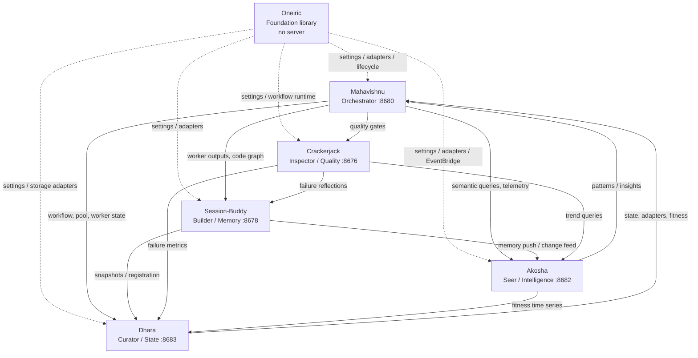
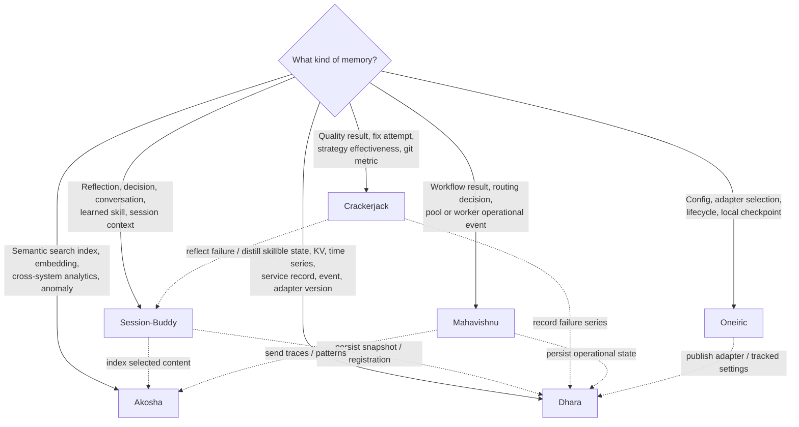
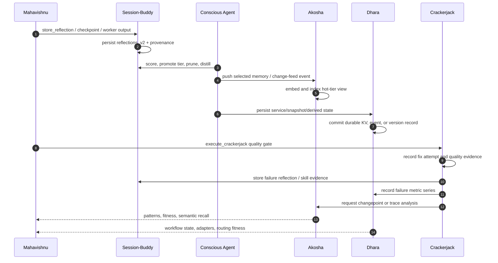
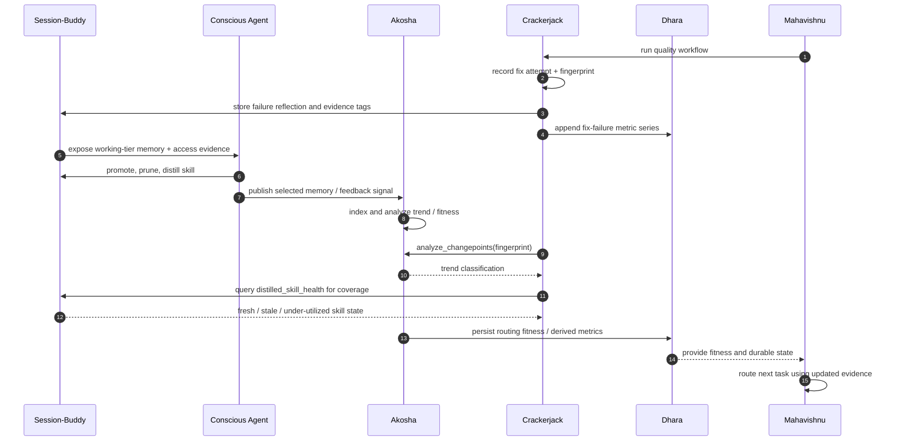

# Bodai Ecosystem Memory Architecture Index

> **Status:** Living navigation document. Update this index when a component's memory contract, tool surface, replication path, or operational recovery procedure changes.
> **Audience:** Bodai contributors, Claude Code users, operators, and maintainers of cross-component integrations.
> **Scope:** Synthesis of the six component architecture documents. Component documents remain authoritative for schemas and implementation detail.

## How to use this index

- Start with [Memory Routing Decision Tree](#2-memory-routing-decision-tree) when deciding where data belongs.
- Use [Per-Component Deep Dives](#3-per-component-deep-dives--link-index) for implementation detail.
- Check [Contract Bug Index](#4-contract-bug-index--the-28-integration-contracts) before changing schemas, registration, aliases, or cross-service calls.
- Follow [Common Tasks](#6-common-tasks-how-to-index) for routine workflows.
- Use [Operational Concerns](#7-operational-concerns) when data is missing or a component is degraded.

Surface counts below count documented table entries, not normalized FastMCP introspection. Combined entries such as `store_conversation / store_conversation_checkpoint` can represent multiple callable names. Profiles also differ: Crackerjack is always-on, while other MCP servers gate some tools.

---

## 1. Ecosystem at a Glance

### Component map

| Component | Role | Port | What goes here |
|---|---|---:|---|
| **Oneiric** | Foundation | None | Layered configuration, adapter resolution/lifecycle, local workflow checkpoints, runtime health, and programmatic infrastructure shared by every component. |
| **Session-Buddy** | Builder / Memory | 8678 | Reflections, conversations, memory tiers, provenance, distilled skills, persistent knowledge-graph snapshots, and session lifecycle. |
| **Akosha** | Seer / Intelligence | 8682 | Hot/warm/cold semantic indexes, embeddings, cross-system search, derived analytics, anomaly/changepoint analysis, and routing fitness. |
| **Dhara** | Curator / State | 8683 | Durable KV, time series, service registry, event log, adapter catalog, versioned substrate state, and backup metadata. |
| **Crackerjack** | Inspector / Quality | 8676 | Quality-run evidence, fix attempts, strategy effectiveness, git metrics, semantic code index, and self-improvement signals. |
| **Mahavishnu** | Orchestrator / Control plane | 8680 | Pool and worker routing, workflow results, routing decisions, OTel ingestion, cross-service dispatch, and ecosystem status. |

### Layer and deployment model

Oneiric is **library-first**: it has no MCP server or service port. Consumers import its Python APIs and persist small local runtime artifacts. Session-Buddy, Akosha, Dhara, and Crackerjack are peer MCP services. Mahavishnu sits above those peers as the control plane and routes work and data among them.

### Authority boundaries

| Data class | Primary authority | Secondary views |
|---|---|---|
| Human/project memory and decisions | Session-Buddy | Akosha search index; Dhara snapshots |
| Cross-system semantic recall | Akosha | Session-Buddy source records; Crackerjack and Mahavishnu specialized indexes |
| Durable operational state | Dhara | Mahavishnu local/in-process mirrors |
| Quality and fix evidence | Crackerjack | Session-Buddy reflections/skills; Dhara failure series; Akosha trend analysis |
| Configuration and provider lifecycle | Oneiric | Dhara adapter catalog and tracked-settings snapshots |
| Workflow execution and routing | Mahavishnu | Dhara workflow results/progress; Akosha routing analytics |

---

## 2. Memory Routing Decision Tree

### Thirty-second routing rule

Store data at the component that owns its lifecycle and authority. Replicate only the view another component needs. Do not make an index, cache, metric stream, or workflow mirror the source of truth.

### Cross-system lifecycle

The diagram shows the intended logical flow. Not every hop is a synchronous transaction, and several are best-effort or background operations.

### Decision table

| Scenario | Store first in | Replicate/query through | Why |
|---|---|---|---|
| Remember a past architectural decision | Session-Buddy | Akosha for cross-system semantic recall | It is durable human/project memory, not an operational event. |
| Save a conversation checkpoint | Session-Buddy | Dhara only if a curated external snapshot is required | Session lifecycle and conversation recall belong to SB. |
| Search semantically across all systems | Akosha | Source records remain in SB/other owners | Akosha owns embeddings, ranking, and analytics. |
| Persist a workflow result for replay | Mahavishnu, then Dhara | `workflow_result` via Mahavishnu | Mahavishnu owns execution semantics; Dhara owns durable state. |
| Record pool or worker terminal state | Mahavishnu, then Dhara | Mahavishnu monitoring tools | Live state is in-process; durable snapshots live in Dhara. |
| Store a service endpoint or heartbeat | Dhara | Consumers call `get`, `list_prefix`, or service tools | Dhara is the service registry and shared KV authority. |
| Publish a new adapter version | Dhara | Oneiric resolves/activates the factory | Catalog durability and lifecycle activation are separate concerns. |
| Configure an LLM or storage provider | Oneiric settings plus environment | Dhara may receive sanitized tracked-settings snapshots | Oneiric owns precedence and adapter selection; secrets stay in env/provider. |
| Save a quality-gate result | Crackerjack | SB reflection and Dhara failure metrics as needed | Crackerjack owns quality evidence and fix strategy learning. |
| Record a repeated failure fingerprint | Crackerjack | Dhara time series; SB reflection; Akosha changepoint | One fingerprint drives evidence, durability, recall, and trend analysis. |
| Store an OTel trace | Akosha or Mahavishnu OTel ingester | Akosha query tools | Traces are observability data, not SB reflection memory. |
| Save a routing fitness signal | Dhara | Mahavishnu TaskRouter and Akosha FitnessAnalyzer | It is durable derived time-series state. |
| Save a routing decision | Mahavishnu | Akosha pattern stream; Dhara only for durable summaries | Decision creation belongs to the orchestrator. |
| Save a resumable library workflow checkpoint | Oneiric | Calling component's workflow runtime | It is local runtime infrastructure, not ecosystem memory. |
| Store a code graph | Mahavishnu owns generation | SB persists recall snapshot; Akosha indexes cross-repo view | Generation, durable recall, and semantic indexing are distinct. |

---

## 3. Per-Component Deep Dives — Link Index

Counts are documented entries in Sections 2 and 3, not guaranteed live-registration counts. Use each component's discovery/profile tests for executable inventory.

### Session-Buddy

Session-Buddy is the canonical store for reflections, conversations, provenance, tier promotion, distilled skills, and persistent memory/KG snapshots. Its `reflections_v2.id` is the main cross-layer anchor.

- Deep dive: [Session-Buddy Memory Architecture](../../../session-buddy/docs/architecture/MEMORY_ARCHITECTURE.md)
- Write surface: **24 documented write/side-effect entries** in §2.
- Read surface: **42 documented read entries** in §3.
- Integration contracts: **3** (§5.1–§5.3).
- User-facing surface: `mcp__session-buddy__store_reflection`, `quick_search`, `search_by_concept`, `search_by_file`, `progressive_search`, `tier_stats`, `distilled_skill_health`, `search_distilled_skills`, code/KG tools; five Claude Code lifecycle hooks.

### Akosha

Akosha owns tiered semantic indexes, embeddings, code-graph search views, analytics, changepoints, and fitness analysis. Its canonical cross-tier anchor is `conversation_id`.

- Deep dive: [Akosha Memory Architecture](../../../akosha/docs/architecture/MEMORY_ARCHITECTURE.md)
- Write surface: **7 documented write/side-effect entries** in §2.
- Read surface: **31 documented read entries** in §3.
- Integration contracts: **4** (§5.1–§5.4).
- User-facing surface: `mcp__akosha__search_all_systems`, `query_local_traces`, `generate_embedding`, code-graph search tools, analytics tools, `run_fitness_analysis`, `store_memory`, `batch_store_memories`, and `publish_to_eventbridge`.

### Dhara

Dhara is the durable state substrate: KV/TTL, time series, ecosystem services and events, adapter versions, HTTP substrate resources, and backup metadata. All logical buckets hang from `Connection.root`.

- Deep dive: [Dhara Memory Architecture](../../../dhara/docs/architecture/MEMORY_ARCHITECTURE.md)
- Write surface: **12 documented write/side-effect entries** in §2.
- Read surface: **30 documented MCP/HTTP/health entries** in §3.
- Integration contracts: **4** (§5.1–§5.4).
- User-facing surface: `mcp__dhara__put`, `get`, `list_prefix`, time-series tools, service/event tools, adapter tools, SQL proxy tools, `discover_tools`, plus HTTP substrate routes and `/tools/call`.

### Mahavishnu

Mahavishnu owns orchestration and routing: workflow execution, pool/worker state, routing decisions, cross-service dispatch, ecosystem status, and operational OTel state. `workflow_id` is its primary cross-store anchor.

- Deep dive: [Mahavishnu Memory Architecture](../../../mahavishnu/docs/architecture/MEMORY_ARCHITECTURE.md)
- Write surface: **52 documented core/group/side-effect entries** in §2; FULL exposes roughly 174 tools.
- Read surface: **118 documented tool-name entries** in §3.
- Integration contracts: **5** (§5.1–§5.5).
- User-facing surface: `mcp__mahavishnu__dispatch_to_pool`, `pool_route_execute`, `workflow_result`, pool/worker tools, `ecosystem_status`, `ecosystem_routing_readiness`, `discover_tools`; `/mahavishnu:status` and `/vishnu` workflows.

### Crackerjack

Crackerjack owns quality and self-improvement evidence: fix attempts, strategy effectiveness, git metrics, semantic code indexes, quality-run state, and failure fingerprints. `issue_fingerprint` joins its evidence to Dhara and SB.

- Deep dive: [Crackerjack Memory Architecture](../../../crackerjack/docs/architecture/MEMORY_ARCHITECTURE.md)
- Write surface: **43 documented tool/side-effect entries** in §2.
- Read surface: **50 documented read entries** in §3; approximately 50 tools are intended always-on.
- Integration contracts: **10** (§5.1–§5.10).
- User-facing surface: `mcp__crackerjack__execute_crackerjack`, `get_job_progress`, quality/monitoring tools, semantic/git search, skills, and `/crackerjack:run`, `/crackerjack:init`, `/crackerjack:status`. `run_crackerjack_stage` is currently a stub.

### Oneiric

Oneiric is the library foundation for layered settings, candidate resolution, lifecycle activation, activity state, workflow checkpoints, and adapter distribution. It has no MCP surface: Python APIs and the `oneiric` CLI are the user-facing boundary.

- Deep dive: [Oneiric Memory Architecture](../../../oneiric/docs/architecture/MEMORY_ARCHITECTURE.md)
- Programmatic write surface: **38 documented API/CLI entries** in §2.
- Programmatic read surface: **35 documented API/CLI entries** in §3.
- Integration contracts: **2** (§5.1–§5.2).
- User-facing surface: `load_settings`, `Resolver.resolve/explain`, `DomainBridge.use`, `LifecycleManager`, `WorkflowCheckpointStore`, and CLI commands `oneiric list`, `explain`, `swap`, `pause`, `drain`, `remote-sync`, `start`, `stop`.

---

## 4. Contract Bug Index — The 28 Integration Contracts

Severity uses **Critical / High / Medium / Low** according to data loss, security exposure, silent false success, and operational impact. Planned test paths are retained because they define the missing regression contract.

### Schema / table mismatch

| Component | Contract | One-line summary | Regression test path | Severity |
|---|---|---|---|---|
| Session-Buddy | 5.1 | Reflection writes and reads must both use `reflections_v2`, not `conversations_v2`. | `tests/integration/test_reflection_round_trip.py::test_store_then_quick_search_round_trip` | High |
| Crackerjack | 5.1 | Bundled `git_metrics_schema.sql` has missing commas and fails `executescript`. | `tests/unit/memory/test_git_metrics_storage.py::test_bundled_schema_has_sql_syntax_errors` | High |
| Crackerjack | 5.2 | `GitMetricsStorage.get_metrics` omits `repository_path` from SELECT and returns `{}`. | `tests/unit/memory/test_git_metrics_storage.py::test_get_metrics_returns_latest_value` | High |

### Dependency injection and lifecycle wiring

| Component | Contract | One-line summary | Regression test path | Severity |
|---|---|---|---|---|
| Session-Buddy | 5.2 | Reflection DB DI registration must use the adapter class key, not a string. | `tests/integration/test_init_reflection_adapter.py::test_init_reflection_adapter_registers_under_class_key` | High |
| Akosha | 5.1 | FastMCP lifespan must be passed in the constructor; private assignment drops startup wiring. | `tests/integration/test_mcp_integration.py::TestMCPIntegration::test_mcp_server_initialization` | High |
| Akosha | 5.4 | FitnessAnalyzer must populate component endpoints before its first cycle and support no-running-loop startup. | `tests/integration/test_fitness_analyzer_discovery.py::test_falls_back_when_no_loop` (planned) | Medium |
| Dhara | 5.1 | Async MCP writes must use async stores, never the sync connection facade. | `tests/test_mcp_server_core.py::TestRunPutAndGet::test_put_and_get_kv_tools` | High |

### Parameter threading and state semantics

| Component | Contract | One-line summary | Regression test path | Severity |
|---|---|---|---|---|
| Session-Buddy | 5.3 | `store_reflection` must persist and search by the supplied `project`. | `tests/integration/test_reflection_round_trip.py::test_store_with_project_filters_by_project` | High |
| Dhara | 5.3 | Substrate `version` is a caller-supplied label, not a monotonic or parent-linked chain. | `tests/integration/mcp/test_http_crud_routes.py::test_post_active_settings_version_returns_200_with_payload` | Medium |
| Mahavishnu | 5.3 | Novel caller-kind strings must coerce to `UNKNOWN` so quota buckets cannot be bypassed. | `tests/integration/test_dispatch_to_pool_flow.py::TestCallerKindHonoredInQuotaAttribution::test_caller_kind_honored_in_quota_attribution` | High |
| Oneiric | 5.1 | Settings layers must preserve the documented precedence through explicit-path highest priority. | `tests/core/test_config_xdg.py::TestConfigPriorityOrder` | High |
| Oneiric | 5.2 | Lifecycle persistence is an atomic full snapshot, not a per-key diff. | `tests/integration/test_lifecycle_persistence.py::test_status_round_trip_through_disk` (planned) | High |

### REST / MCP surface mismatch

| Component | Contract | One-line summary | Regression test path | Severity |
|---|---|---|---|---|
| Dhara | 5.2 | REST `/tools/call` supports only seven tools despite the broader MCP surface. | `tests/integration/mcp/test_tools_call_route.py::test_record_event_round_trip_through_tools_call` (planned) | High |
| Crackerjack | 5.5 | `discover_tools` is absent, so clients cannot introspect Crackerjack consistently. | `tests/test_mcp_server.py::test_discover_tools_lists_loaded_tools` (planned) | Medium |

### Security / ACL

| Component | Contract | One-line summary | Regression test path | Severity |
|---|---|---|---|---|
| Mahavishnu | 5.1 | Validate `workflow_id` before interpolating it into Dhara key paths. | `tests/integration/test_dispatch_to_pool_flow.py::TestWorkflowIdValidation` | Critical |
| Mahavishnu | 5.4 | Peer-affinity hints are non-authoritative; ACL and allowlist must permit routing. | `tests/integration/test_pool_routing_peer_affinity.py::test_peer_affinity_no_acl_falls_back_to_least_loaded` | High |

### Async and dead-letter behavior

| Component | Contract | One-line summary | Regression test path | Severity |
|---|---|---|---|---|
| Mahavishnu | 5.2 | Async dispatch must return immediately and dead-letter terminal-state persistence failures. | `tests/integration/test_dispatch_to_pool_flow.py::TestAsyncResultLifecycleResultWriteFailed::test_async_result_lifecycle_result_write_failed` | Critical |
| Crackerjack | 5.8 | Improvement generation returns a job ID although no diff-generation consumer is wired. | `tests/unit/services/test_improvement_generator.py::TestImprovementGeneratorNoiseGate::test_generator_triggers_when_ge_3_similar_failures` | High |

### Tool profile / discovery drift

| Component | Contract | One-line summary | Regression test path | Severity |
|---|---|---|---|---|
| Dhara | 5.4 | STANDARD and FULL are currently identical and must be explicitly pinned until widened. | `tests/unit/test_profiles.py::test_full_groups_match_standard_until_workstream_d` (planned) | Low |
| Mahavishnu | 5.5 | `discover_tools(capability="ready")` must report live routable workers, not registration methods. | `tests/integration/test_mcp_tools.py::TestDiscoverToolsRoutableWorkers` | Medium |

### Slash-command / MCP alias drift

| Component | Contract | One-line summary | Regression test path | Severity |
|---|---|---|---|---|
| Crackerjack | 5.3 | `crackerjack_run` is not a tool; canonical full-run entry is `execute_crackerjack`. | `tests/test_mcp_core_tools.py::test_run_crackerjack_stage_legacy_stub` | High |
| Crackerjack | 5.4 | Skill coverage requires SB's `distilled_skill_health` and lacks graceful MCP failure handling. | `tests/integration/test_skill_coverage_report.py::test_skill_coverage_report_three_skill_acceptance` | Medium |

### Stub / not implemented

| Component | Contract | One-line summary | Regression test path | Severity |
|---|---|---|---|---|
| Akosha | 5.2 | `search_all_systems` returns a canned result instead of searching HotStore. | `tests/integration/test_full_integration.py::test_search_all_systems_returns_real_results_after_store` (planned) | Critical |
| Crackerjack | 5.6 | `analyze_crackerjack` returns literal `mock_success`. | `tests/test_mcp_utility_tools.py::test_analyze_crackerjack_returns_real_analysis` (planned) | High |
| Crackerjack | 5.7 | All workspace tools call a removed backend and raise `NotImplementedError`. | `tests/test_mcp_workspace_tools.py::test_create_workspace_returns_201_when_backend_restored` (planned) | High |
| Crackerjack | 5.9 | PyCharm symbol-info and find-usages tools intentionally return `not_implemented`. | `tests/mcp_test_helpers/tools/test_pycharm_tools.py` | Medium |
| Crackerjack | 5.10 | `run_crackerjack_stage` is a Phase-2 removal stub; use `execute_crackerjack`. | `tests/test_mcp_core_tools.py::test_run_crackerjack_stage_returns_phase2_stub_error` | High |

### Event envelope contract

| Component | Contract | One-line summary | Regression test path | Severity |
|---|---|---|---|---|
| Akosha | 5.3 | EventBridge envelopes must use `source=akosha`, version `1.0.0`, UUID, and UTC timestamp. | `tests/integration/test_oneiric_transport_roundtrip.py::test_publish_pattern_detected_round_trips_through_real_eventbridge` | High |

**Total indexed: 28 contracts** — Session-Buddy 3, Akosha 4, Dhara 4, Mahavishnu 5, Crackerjack 10, Oneiric 2.

---

## 5. Cross-Cutting Patterns

### 5.1 Tool-profile and registration-schema drift

The recurring shape is not just “a count changed.” A profile or registration module describes groups, while decorators elsewhere define individual tools. Refactors update one side and tests often pin the already-drifted state rather than deriving the intended inventory.

| Component | Concrete manifestation |
|---|---|
| Akosha | MINIMAL/STANDARD/FULL are distinct, but each registration function expands to many tools; count coverage depends on `DummyFastMCP` profile tests. |
| Dhara | FULL equals STANDARD despite profile terminology implying a wider surface. |
| Mahavishnu | `profiles.py` lists about 14 registration methods while `tool_versions.py` lists roughly 174 individual tools; method count cannot prove tool completeness. |
| Crackerjack | No profile gate; library and entry-point registration paths differ, and exported `register_*` functions are not uniformly wired by `create_mcp_server`. |

**Fix pattern:** for each executable server factory, instantiate a recording FastMCP in tests and assert exact tool names and per-group counts for every profile. Derive documentation from that manifest. A weak `count >= N` assertion does not detect silent replacement, alias loss, or stub exposure.

### 5.2 Slash-command versus MCP-tool alias drift

Crackerjack exposes the clearest example: prompts and plans refer to `crackerjack_run`, but the real full-workflow tool is `execute_crackerjack`; `run_crackerjack_stage` exists but is a stub. This is direct user-facing breakage because Claude Code follows prompt text and receives “tool not found” or a misleading stub result.

**Fix pattern:** parse every command/prompt Markdown file for `mcp__*` and bare tool references, compare them with the live FastMCP manifest, and fail CI on unknown or deprecated aliases. Allow explicit aliases only in a versioned compatibility map with a removal date.

### 5.3 Workstream D: DDL in migrations versus runtime inline storage

Dhara defines SQL substrate tables in migration files, but runtime HTTP routes still append dicts to lists under `Connection.root`. Mahavishnu writes workflow results through Dhara KV rather than the planned workflow-progress SQL substrate. Oneiric's `TrackedSettings` posts to expected Dhara endpoints with local fallback files, while the authoritative Dhara runtime surface is not the DDL-shaped API implied by that client.

Consequences:

1. Schema exists in two forms with different keys and integrity semantics.
2. Running migrations does not migrate the live authority.
3. Tests can pass against DDL while production uses the object graph.
4. Parent linkage, uniqueness, and audit guarantees are documentation-only.

**Fix pattern:** choose one runtime authority, invoke its migration runner during application initialization, dual-write only behind a measured migration flag, compare identities, then cut over reads before deleting the inline representation.

### 5.4 Library-first versus MCP-server documentation

Oneiric demonstrates why a uniform “MCP Write Surface / MCP Read Surface” template is wrong. Its contract boundary is Python imports, local state files, and CLI commands. Forcing MCP terminology would imply a server and discovery surface that do not exist.

Use capability-neutral headings in global templates:

- “Write surface” with an access-mechanism column.
- “Read surface” with MCP, HTTP, CLI, or Python values.
- “Health surface” with “host-process health” for libraries.
- “Port” explicitly set to “none — embedded library,” not “N/A service.”

### 5.5 Conscious Agent cross-cutting loop

The closed learning loop spans ownership boundaries:

1. Session-Buddy captures and promotes memory, then distills patterns.
2. Akosha evaluates semantic similarity, trends, anomalies, and fitness.
3. Crackerjack contributes concrete quality/fix evidence and consumes distilled skill health.
4. Dhara stores shared failure/fitness series and durable snapshots.
5. Mahavishnu schedules the work and routes resulting evidence.

The loop is **eventually consistent**, not a single transaction. Every producer needs an idempotency key (`reflection_id`, `conversation_id`, `workflow_id`, or `issue_fingerprint`) and an observable retry/dead-letter path.

### 5.6 Integration contract test policy

Consolidated policy from all six component documents:

- Exercise canonical initialization and registration, not fixture-only shortcuts.
- Use real temporary DuckDB/SQLite/object stores for write/read contracts.
- Use a real Oneiric `LifecycleManager` and EventBridge for lifecycle/envelope tests.
- Mock only external boundaries that cannot run locally; use protocol fakes rather than unconstrained mocks.
- Assert record identity, unique content markers, IDs, and envelope fields; never rely on `len(results) >= 1`.
- Test every profile and server-construction path, including library factory and CLI entry point.
- Pin negative behavior explicitly while a stub exists, but name the test so it cannot be mistaken for feature completion.
- Verify auth and ACL at the real route/tool boundary.
- Test degraded behavior: missing Dhara, SB, Akosha, publisher, embedding model, and no-running-loop startup.

### 5.7 Additional pattern: authority versus replica is often implicit

Across the documents, “stores” sometimes mean authority, cache, index, derived metric, or transient mirror. Akosha's hot copies are not raw reflection authority; SB's code graph is a recall snapshot rather than generator authority; Mahavishnu's pool state is live in memory but durable in Dhara; Oneiric's runtime telemetry is last-value-only.

**Recommendation:** add `authority_kind: source | replica | index | cache | derived | transient` to every future storage inventory row. Backup and recovery procedures should only promise restoration appropriate to that kind.

### 5.8 Additional pattern: best-effort fan-out can hide partial success

SB hooks continue when capture fails; Crackerjack suppresses SB/Dhara failures; Akosha can start without Dhara registration; Mahavishnu can continue when WebSocket broadcast fails; Oneiric writes fallback files when Dhara is unavailable. Availability is favored over atomicity, but users often receive only the primary operation's success.

**Recommendation:** return or emit a shared replication receipt containing primary status, per-target status, idempotency key, retry location, and `fully_replicated` boolean.

### 5.9 Additional pattern: local fallback queues lack a common replay protocol

Mahavishnu dead letters, Oneiric pending snapshots, Bodai event queues, and transient Crackerjack JSON state use unrelated locations and replay rules. This makes ecosystem recovery operator-dependent.

**Recommendation:** define a versioned Bodai dead-letter envelope and expose list/replay/ack metrics consistently, even if each component retains its own local directory.

---

## 6. Common Tasks (How-To Index)

### Store a reflection and recall it later

1. Write through `mcp__session-buddy__store_reflection` with project and tags.
2. Recall with `quick_search` or `search_by_concept`.
3. Use Akosha only for a replicated cross-system semantic view.

See [Session-Buddy §2](../../../session-buddy/docs/architecture/MEMORY_ARCHITECTURE.md#2-mcp-write-surface), [Session-Buddy §3](../../../session-buddy/docs/architecture/MEMORY_ARCHITECTURE.md#3-mcp-read-surface), and [Akosha §3](../../../akosha/docs/architecture/MEMORY_ARCHITECTURE.md#3-mcp-read-surface).

### Persist a workflow result for replay

1. Dispatch via Mahavishnu with a validated/generated `workflow_id`.
2. Mahavishnu persists the terminal envelope to Dhara `workflow-results/{id}/`.
3. Poll `workflow_result`; if persistence failed, inspect Mahavishnu's async dead-letter path.

See [Mahavishnu §1](../../../mahavishnu/docs/architecture/MEMORY_ARCHITECTURE.md#1-storage-inventory), [Mahavishnu §5.1–5.2](../../../mahavishnu/docs/architecture/MEMORY_ARCHITECTURE.md#5-integration-contract), and [Dhara §1](../../../dhara/docs/architecture/MEMORY_ARCHITECTURE.md#1-storage-inventory).

### Run a quality gate and capture the result

1. Call `mcp__crackerjack__execute_crackerjack`; do not use the stage stub.
2. Poll `get_job_progress(job_id)`.
3. Crackerjack records fix evidence; failures fan out to SB reflections and Dhara metrics.

See [Crackerjack §2](../../../crackerjack/docs/architecture/MEMORY_ARCHITECTURE.md#2-mcp-write-surface), [Crackerjack §5.3](../../../crackerjack/docs/architecture/MEMORY_ARCHITECTURE.md#contract-53--crackerjack_run-does-not-exist-as-a-single-mcp-tool), and [Session-Buddy §2](../../../session-buddy/docs/architecture/MEMORY_ARCHITECTURE.md#2-mcp-write-surface).

### Diagnose a “tool not found” error

1. Confirm component and exact tool name.
2. Call `discover_tools` where supported and inspect the active profile.
3. For Crackerjack, compare against `create_mcp_server` registration and this index's alias warning.
4. Check whether the tool is profile-gated, runtime-gated, missing, or a stale slash-command alias.

See [§5.1](#51-tool-profile-and-registration-schema-drift), [§5.2](#52-slash-command-versus-mcp-tool-alias-drift), [Mahavishnu §5](../../../mahavishnu/docs/architecture/MEMORY_ARCHITECTURE.md#5-integration-contract), and [Crackerjack §5.3/5.5](../../../crackerjack/docs/architecture/MEMORY_ARCHITECTURE.md#5-integration-contract).

### Add a new MCP tool

1. Implement and register the tool in the component's canonical server factory.
2. Add it to every applicable profile and discovery/version manifest.
3. Add an identity-based round-trip test and exact profile inventory test.
4. Update the per-repo architecture document; update this index only when routing or cross-cutting behavior changes.

See [§5.1](#51-tool-profile-and-registration-schema-drift) and the target component's §2, §3, and §5.

### Publish or activate an adapter

1. Publish catalog metadata to Dhara `store_adapter`.
2. Resolve and activate through Oneiric's `Resolver` / `DomainBridge` / `LifecycleManager`.
3. Treat Dhara catalog history and Oneiric local lifecycle snapshot as different authorities.

See [Dhara §2](../../../dhara/docs/architecture/MEMORY_ARCHITECTURE.md#2-mcp-write-surface), [Oneiric §2](../../../oneiric/docs/architecture/MEMORY_ARCHITECTURE.md#2-programmatic-write-surface), and [Oneiric §3](../../../oneiric/docs/architecture/MEMORY_ARCHITECTURE.md#3-programmatic-read-surface).

### Investigate a repeated quality failure

1. Start with Crackerjack's `issue_fingerprint` and fix-attempt evidence.
2. Query Dhara's `fix-failures` series for recurrence.
3. Ask Akosha for changepoint/trend classification.
4. Search SB for prior reflections or distilled skills.

See [Crackerjack §1](../../../crackerjack/docs/architecture/MEMORY_ARCHITECTURE.md#1-storage-inventory), [Dhara §3](../../../dhara/docs/architecture/MEMORY_ARCHITECTURE.md#3-mcp-read-surface), [Akosha §3](../../../akosha/docs/architecture/MEMORY_ARCHITECTURE.md#3-mcp-read-surface), and [Session-Buddy §3](../../../session-buddy/docs/architecture/MEMORY_ARCHITECTURE.md#3-mcp-read-surface).

### Change configuration safely

1. Identify the owning component and Oneiric `project_name`.
2. Apply the correct precedence layer; keep secrets in environment/provider storage.
3. Restart components that do not hot-reload.
4. Verify the resolved provider/lifecycle state, not just the YAML file.

See [Oneiric §5.1](../../../oneiric/docs/architecture/MEMORY_ARCHITECTURE.md#contract-51--load_settings-layer-precedence-xdg-local-wins-over-project-local-env-wins-over-xdg-local-explicit-path-wins-over-everything) and the component's Operational Notes.

---

## 7. Operational Concerns

### Health endpoints and probes

| Component | Health surface | Primary checks |
|---|---|---|
| Session-Buddy | MCP health tools and service health on port 8678 | MCP availability, reflection DB access, embedding degradation, Conscious Agent supervision. |
| Akosha | `get_liveness`, `get_readiness`, `health_check_service`, `health_check_all`, `/health`-style service probes on 8682 | HotStore, embedding mode, Dhara registration, FitnessAnalyzer status. |
| Dhara | MCP health tools; HTTP `/health`, `/healthz`, `/ready`, `/readyz`, `/metrics` on 8683 | Storage accessibility, backup catalog, dependencies, auth. |
| Mahavishnu | `get_health`, `ecosystem_status`, `health_check*`, `get_liveness`, `get_readiness`, WebSockets 8690/8691 | Peer services, pools/workers, adapters, routing readiness, alerts. |
| Crackerjack | Registered health tools plus `get_server_stats`, `get_comprehensive_status`; MCP 8676, WebSocket 8696 | Server process, jobs, progress files, optional EventBridge/PyCharm dependencies. |
| Oneiric | No endpoint; host-process CLI/files: `oneiric remote-status`, `process-status`, `runtime_health.json` | Resolver registrations, lifecycle status, watcher/supervisor state, checkpoint DB access. |

### Cross-component replication topology

| Producer | Destination | Data pushed | Authority after push |
|---|---|---|---|
| Session-Buddy | Akosha | Selected memories, embeddings/change feed | SB remains source; Akosha is search index. |
| Session-Buddy | Dhara | Service registration, curated/version snapshots | SB source; Dhara durable ecosystem state. |
| Crackerjack | Session-Buddy | Failure reflections and skill evidence | Crackerjack owns fix evidence; SB owns reflection/skill memory. |
| Crackerjack | Dhara | Failure KV and time-series records | Dhara owns shared metric stream. |
| Crackerjack | Akosha | Trace/changepoint queries, not primary writes | Akosha owns derived analysis. |
| Mahavishnu | Dhara | Workflow results, pool/worker snapshots, routing fitness, adapters | Dhara owns durable state; Mahavishnu owns execution semantics. |
| Mahavishnu | Akosha | Routing decisions, patterns, traces/code views | Mahavishnu source; Akosha derived/index view. |
| Mahavishnu | Session-Buddy | Worker reflections and generated code graph snapshots | SB owns persisted recall copy. |
| Akosha | Dhara | Routing-fitness and derived time series, endpoint registration | Dhara owns durable series and registry. |
| Oneiric | Dhara | Built-in adapter catalog and tracked-settings snapshots | Oneiric owns resolution semantics; Dhara owns distributed catalog/snapshot. |

### Missing-memory escalation order

1. **Identify the authority.** Use the routing table; do not begin at a replica.
2. **Check the owning process/library health.** Confirm MCP port or Oneiric host process.
3. **Verify exact write response and identity.** Capture reflection ID, workflow ID, fingerprint, or adapter ID.
4. **Read directly from the owner's canonical surface.** Avoid semantic indexes and dashboards initially.
5. **Check profile and alias registration.** A missing tool can look like missing data.
6. **Check replication/dead-letter status.** Inspect Mahavishnu async dead letters, Oneiric pending snapshots, event queue state, and component logs.
7. **Check derived stores.** Akosha embedding mode/hot-store restart, Dhara TTL/retention, SB tier promotion/pruning, Crackerjack SQLite schema/locks.
8. **Check contract regressions.** Prioritize SB 5.1/5.3, Akosha 5.1/5.2, Dhara 5.1/5.2, Mahavishnu 5.1/5.2, and Crackerjack 5.1–5.3.
9. **Restore only the authority.** Rebuild replicas/indexes from source after recovery.

### Backup and recovery paths

| Component | Back up | Recovery path / caveat |
|---|---|---|
| Session-Buddy | Reflection DuckDB and relevant serverless backends | `scripts/backup_reflection_db.py`; restore source DB, then rebuild semantic replicas. V1 is read-compatible; all new writes target V2. |
| Akosha | Warm DuckDB, persistent pgvector when enabled, cold objects when implemented | Hot `:memory:` is rebuildable and lost on restart; cold upload remains incomplete. Re-ingest from source snapshots. |
| Dhara | SQLite/PostgreSQL object store, backup catalog, cloud backup objects | `dhara backup full` and restore tooling; full/incremental/differential retention 30/7/14 days. SQL substrate migrations do not restore the active inline substrate by themselves. |
| Mahavishnu | Dhara-backed workflow state, OTel DB, settings, dead-letter/event queues | `mahavishnu backup create --type=full`; replay async dead letters and event queue after restoring Dhara. Preserve legacy `~/.mahavishnu` as well as XDG paths. |
| Crackerjack | Fix-strategy, git-metrics, semantic-index, adapter-learning SQLite DBs | Use SQLite `.backup`/Litestream/WAL tooling. Oneiric workflow checkpoints are cache-like; active MCP session JSON is transient. Fix bundled schema before relying on migration recreation. |
| Oneiric | Settings files, workflow checkpoint SQLite, optional activity/lifecycle state, pending snapshots | Copy settings and checkpoint DB; lifecycle/health/telemetry can usually cold-start. Replay pending tracked-settings snapshots manually. |

### Recovery invariants

- Restore the source of truth before an index or derived metric.
- Keep join keys unchanged across restore: reflection ID, conversation ID, workflow ID, issue fingerprint, or `(domain, key)`.
- Do not infer successful replication from a successful primary operation.
- Re-run exact round-trip regression tests after restoration.
- Preserve security constraints during replay: workflow-ID validation, ACL checks, auth, and secret redaction.

---

## Source Documents

- [Session-Buddy Memory Architecture](../../../session-buddy/docs/architecture/MEMORY_ARCHITECTURE.md)
- [Akosha Memory Architecture](../../../akosha/docs/architecture/MEMORY_ARCHITECTURE.md)
- [Dhara Memory Architecture](../../../dhara/docs/architecture/MEMORY_ARCHITECTURE.md)
- [Mahavishnu Memory Architecture](../../../mahavishnu/docs/architecture/MEMORY_ARCHITECTURE.md)
- [Crackerjack Memory Architecture](../../../crackerjack/docs/architecture/MEMORY_ARCHITECTURE.md)
- [Oneiric Memory Architecture](../../../oneiric/docs/architecture/MEMORY_ARCHITECTURE.md)
